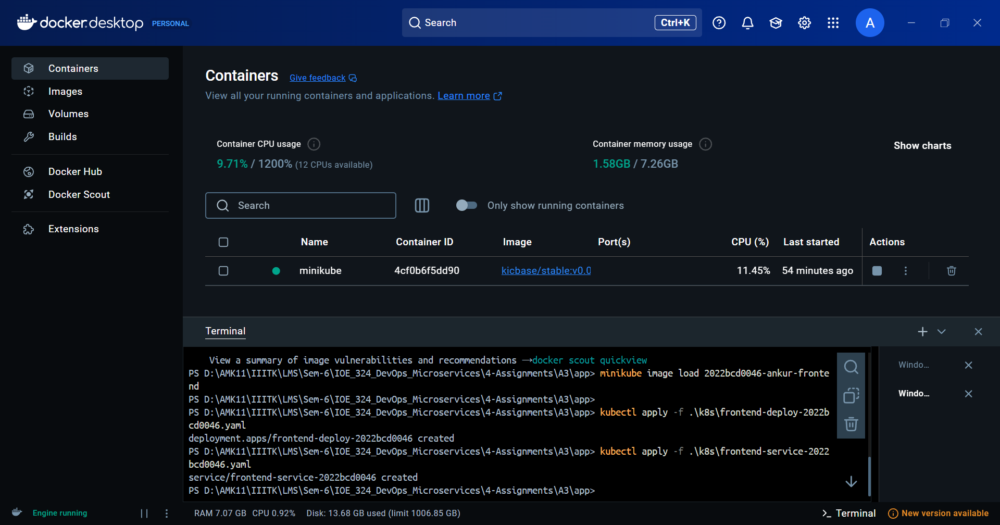

# <center>Assignment - 3: Minikube & K8s</center>

### Name: Ankur Majumdar
### Roll No: 2022BCD0046

---

## 1. App Overview

A Full Stack Web Application using React, Node.js, MongoDB that Allows Student Data Management as:

- View Student:
  

- Add Student:
  
  

- Delete Student:
  

---

**GitHub Repo:** [https://github.com/Ankur7891/MiniKube-Deploy-App/](https://github.com/Ankur7891/MiniKube-Deploy-App/)

---

## 2. App Components

### A. Backend (Node.js + Express with MongoDB)
`server.js`
```js
import express from 'express';
import mongoose from 'mongoose';
import cors from 'cors';
import dotenv from 'dotenv';

dotenv.config();

const PORT = process.env.PORT || 5000;
const { MONGO_URI } = process.env;

// App & Middlewares
const app = express();
app.use(express.json());
app.use(cors());

// DB Connection
mongoose
  .connect(MONGO_URI)
  .then(() => console.log(`MongoDB Connected!`))
  .catch((err) => console.error('MongoDB Connection Error:', err));

// Mongoose Schema
const studentSchema = new mongoose.Schema({
  name: {
    type: String,
    required: true,
  },
  rollNo: {
    type: String,
    required: true,
  },
});

const Student = mongoose.model('Student', studentSchema);

// CRUD Operations
app.get('/students/all', async (_, res) => {
  const students = await Student.find();
  res.json(students);
});
app.post('/students', async (req, res) => {
  const { name, rollNo } = req.body;
  const newStudent = new Student({name: name, rollNo: rollNo.toUpperCase() });
  await newStudent.save();
  res.json(newStudent);
});
app.delete('/students/:id', async (req, res) => {
  await Student.findByIdAndDelete(req.params.id);
  res.json({ message: 'Student Deleted' });
});

// Server Listening
app.listen(PORT, () => {
  console.log(`Server is Running on Port: ${PORT}`);
});
```

`Dockerfile`
```Dockerfile
# Use Node.js LTS (Alpine)
FROM node:18-alpine

# Set Working Directory
WORKDIR /app

# Copy Package Files and Install Dependencies
COPY package.json package-lock.json ./
RUN npm install

# Copy App Files
COPY . .

# Expose Port
EXPOSE 5000

# Start the App
CMD ["npm", "start"]
```

### B. Frontend (React)
`App.jsx`
```jsx
import React, { useEffect, useState } from 'react';
import { axiosInstance } from '@/lib/axios';
import StudentTable from '@/components/page-components/StudentTable';
import AddStudent from '@/components/page-components/AddStudent';

function App() {
  const [students, setStudents] = useState([]);

  const fetchStudents = async () => {
    const response = await axiosInstance.get('/students/all');
    setStudents(response.data);
  };

  useEffect(() => {
    fetchStudents();
  }, []);

  return (
    <div className="max-w-2xl mx-auto mt-10 p-4">
      <h1 className="text-3xl font-bold text-center">Student Management</h1>
      <h3></h3>
      <AddStudent fetchStudents={fetchStudents} />
      <StudentTable students={students} fetchStudents={fetchStudents} />
    </div>
  );
}

export default App;
```

`components/page-components/AddStudent.jsx`
```jsx
import React, { useState } from 'react';
import { axiosInstance } from '@/lib/axios';
import { Button } from '@/components/ui/button';
import { Input } from '@/components/ui/input';

const AddStudent = ({ fetchStudents }) => {
  const [name, setName] = useState('');
  const [rollNo, setRollNo] = useState('');

  const handleSubmit = async (e) => {
    e.preventDefault();
    await axiosInstance.post('/students', { name, rollNo });
    setName('');
    setRollNo('');
    fetchStudents();
  };

  return (
    <form onSubmit={handleSubmit} className="w-full p-4 pb-0">
      <div className="flex space-x-2 py-2 mb-4">
        <h2 className="text-xl font-bold mt-1">New?</h2>
        <Input
          type="text"
          placeholder="Roll No"
          value={rollNo}
          onChange={(e) => setRollNo(e.target.value)}
          required
        />
        <Input
          type="text"
          placeholder="Name"
          value={name}
          onChange={(e) => setName(e.target.value)}
          required
        />
        <Button type="submit">Add</Button>
      </div>
    </form>
  );
};

export default AddStudent;
```

`components/page-components/StudentTable.jsx`
```jsx
import React from 'react';
import { axiosInstance } from '@/lib/axios';
import { Button } from '@/components/ui/button';
import {
  Table,
  TableHeader,
  TableRow,
  TableHead,
  TableBody,
  TableCell,
} from '@/components/ui/table';

const StudentTable = ({ students, fetchStudents }) => {
  const deleteStudent = async (id) => {
    await axiosInstance.delete(`/students/${id}`);
    fetchStudents();
  };

  return (
    <div className="w-full px-4">
      <Table className="border border-primary">
        <TableHeader>
          <TableRow className="bg-primary hover:bg-primary/80">
            <TableHead className="w-32 ps-4">Roll No</TableHead>
            <TableHead className="text-center">Name</TableHead>
            <TableHead className="pe-4 text-right">Actions</TableHead>
          </TableRow>
        </TableHeader>
        <TableBody>
          {students.map((student) => (
            <TableRow key={student._id}>
              <TableCell className="ps-4">{student.rollNo}</TableCell>
              <TableCell className="text-center">{student.name}</TableCell>
              <TableCell className="text-right">
                <Button
                  variant="destructive"
                  size="sm"
                  onClick={() => deleteStudent(student._id)}
                >
                  Delete
                </Button>
              </TableCell>
            </TableRow>
          ))}
        </TableBody>
      </Table>
    </div>
  );
};

export default StudentTable;
```

`Dockerfile`
```Dockerfile
# Use Node.js LTS (Alpine)
FROM node:18-alpine 

# Set Working Directory
WORKDIR /app

# Copy Package Files and Install Dependencies
COPY package.json package-lock.json ./
RUN npm install --frozen-lockfile

# Copy App Files
COPY . .

# Build App for Production
RUN npm run build

# Use Nginx to Serve the Built Frontend
FROM nginx:alpine

# Copy the Built Files to Nginx's Folder
COPY --from=0 /app/dist /usr/share/nginx/html

# Expose Port 80
EXPOSE 80

# Start Nginx
CMD ["nginx", "-g", "daemon off;"]
```

---

## 3. Kubernetes Components

### A. Deployment
`backend-deploy-2022bcd0046.yaml`
```yaml
apiVersion: apps/v1
kind: Deployment
metadata:
  name: backend-deploy-2022bcd0046
spec:
  replicas: 1
  selector:
    matchLabels:
      app: backend
  template:
    metadata:
      labels:
        app: backend
    spec:
      containers:
      - name: backend
        image: docker.io/library/2022bcd0046-ankur-backend
        imagePullPolicy: Never
        ports:
        - containerPort: 5000
        envFrom:
        - configMapRef:
            name: db-config-2022bcd0046
        - secretRef:
            name: secrets-2022bcd0046
        resources:
          requests:
            cpu: "250m"    
            memory: "256Mi"
          limits:
            cpu: "500m" 
            memory: "512Mi"
```
`frontend-deploy-2022bcd0046.yaml`
```yaml
apiVersion: apps/v1
kind: Deployment
metadata:
  name: frontend-deploy-2022bcd0046
  ```yaml
  apiVersion: apps/v1
kind: Deployment
metadata:
  name: frontend-deploy-2022bcd0046
spec:
  replicas: 1
  selector:
    matchLabels:
      app: frontend
  template:
    metadata:
      labels:
        app: frontend
    spec:
      containers:
      - name: frontend
        image: 2022bcd0046-ankur-frontend
        ports:
        - containerPort: 80
        resources:
          requests:
            cpu: "250m"    
            memory: "256Mi"
          limits:
            cpu: "500m" 
            memory: "512Mi"
  ```

### B. ConfigMap
`db-config-2022bcd0046.yaml`
```yaml
apiVersion: v1
kind: ConfigMap
metadata:
  name: db-config-2022bcd0046
data:
  MONGO_URI: "<dbstring>"
```

### C. Secrets
`secrets-2022bcd0046.yaml`
```yaml
apiVersion: v1
kind: Secret
metadata:
  name: secrets-2022bcd0046
type: Opaque
data:
  PASSWORD: root
  SECRET: test
```

### D. Service
`backend-service-2022bcd0046.yaml`
```yaml
apiVersion: v1
kind: Service
metadata:
  name: backend-service-2022bcd0046
spec:
  selector:
    app: backend
  ports:
    - protocol: TCP
      port: 80
      targetPort: 5000
  type: NodePort
```

`frontend-service-2022bcd0046.yaml`
```yaml
apiVersion: v1
kind: Service
metadata:
  name: frontend-service-2022bcd0046
spec:
  type: NodePort
  selector:
    app: frontend
  ports:
  - protocol: TCP
    port: 80
    targetPort: 80
    nodePort: 30080
```

---

## 4. Deploying in Minikube

### A. Create a Minikube Cluster

- #### Start Minikube
```sh
minikube start
```


- #### Build and Load Backend Image
```sh
docker build -t 2022bcd0046-ankur-backend ./backend
minikube image load 2022bcd0046-ankur-backend
kubectl apply -f .\k8s\secrets-2022bcd0046.yaml
kubectl apply -f .\k8s\db-config-2022bcd0046.yaml
kubectl apply -f .\k8s\backend-deploy-2022bcd0046.yaml
kubectl apply -f .\k8s\backend-service-2022bcd0046.yaml
minikube service backend-service-2022bcd0046 --url
```


- #### Build and Load Frontend Image
```sh
docker build -t 2022bcd0046-ankur-frontend ./frontend
minikube image load 2022bcd0046-ankur-frontend
kubectl apply -f .\k8s\frontend-deploy-2022bcd0046.yaml
kubectl apply -f .\k8s\frontend-service-2022bcd0046.yaml
minikube service frontend-service-2022bcd0046 --url
```





- #### Making Changes to Integrate 
`frontend/.env`
```env
VITE_API_URL=http://backend-service-2022bcd0046:80
```

- #### Port Forwarding
```sh
kubectl port-forward svc/backend-service-2022bcd0046 5000:80
kubectl port-forward svc/frontend-service-2022bcd0046 8080:80
```


## 5. Testing the Deployment
```sh
http://localhost:8080/
kubectl exec -it frontend-deploy-2022bcd0046-7475cd5486-j4gmr -- curl -X GET http://backend-service-2022bcd0046/students/all
```


---

## <center>Thank You!</center>
